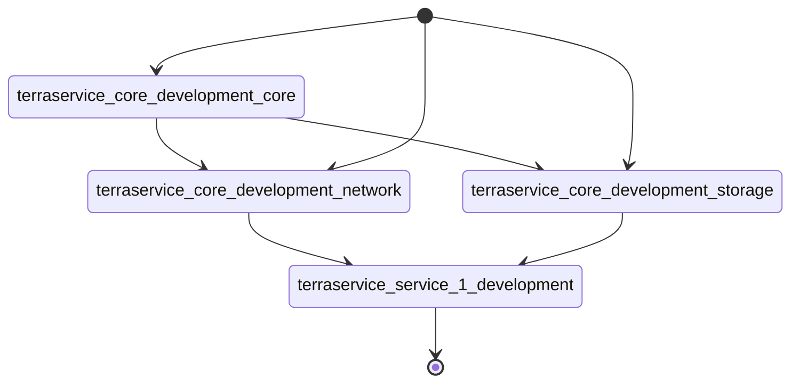

# terraservice-service1
Service1 Terraform module to test a [Multirepo](https://www.hashicorp.com/blog/terraform-mono-repo-vs-multi-repo-the-great-debate) project with a [terraservice](https://www.hashicorp.com/resources/evolving-infrastructure-terraform-opencredo) approach using Terraform Cloud.

The Terraform files of this repository will be able to retrieve the resources exported by the [Core repo](https://github.com/awoisoak/terraservice-core)  which contain the core infrastructure of the GCP project.

Since it's using Terraform Cloud it can retrieve them via [tfe_outputs](https://registry.terraform.io/providers/hashicorp/tfe/latest/docs/data-sources/outputs) (instead of using [terraform_remote_state](https://developer.hashicorp.com/terraform/language/state/remote-state-data)) to avoid having to share the states between the workspaces since they contain sensitive data.

Observations:
- This repository doesn't follow the Core repo approach of having its own split states per module (other than the environment based) just for the sake of simplicity.

TODO:
- Add _stable_ environment
